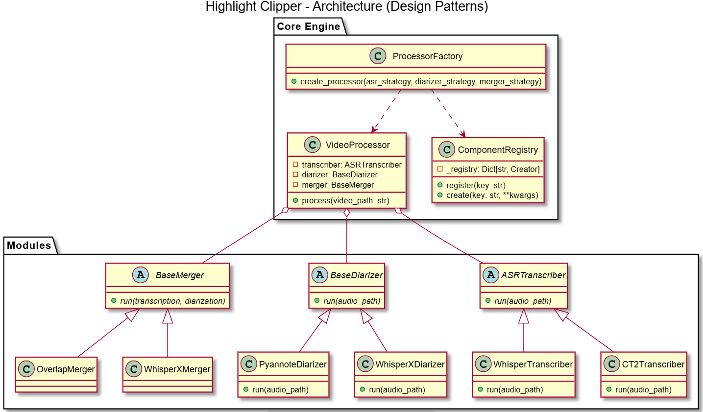

# Auto Clip Game Video (Experimental Prototype)

這是一個用來自動擷取遊戲影片對話精華的實驗性專案。

專案的核心目標是透用語音辨識 (ASR) 與講者分離 (Speaker Diarization) 技術，自動找出遊戲影片中的重要對話片段。儘管在實際開發後，發現目前開源模型處理「複雜遊戲背景音與人聲分離」的效果仍有其天花板，但**本專案的架構設計宗旨在於打造一個「高彈性、易於實驗」的測試平台**。

## 系統架構與設計模式 (Design Patterns)

在 AI 專案中，模型的迭代速度極快。為了解決「多方案切換」與「依賴過重」的問題，本專案在架構上應用了以下設計思維：

### 1. 系統架構圖


### 2. Registry & Factory Pattern (註冊表與工廠模式)

為了避免在主程式中寫滿冗長的 `if-else` 模型切換邏輯，我們結合了註冊表與工廠模式：
*   **動態註冊表 (`registry.py`)**：
    *   **高擴充性 (Open-Closed Principle)**：想加入新模型（例如下個世代的 Whisper、或是針對各情境特化的模型），只需實作類別並加上 `@register("名稱")` 裝飾器，不需修改核心工廠或業務邏輯。
*   **統一工廠 (`ProcessorFactory`)**：
    *   **封裝複雜度**：將 `VideoProcessor` 所需的 ASR、Diarizer、Merger 等多個策略模組的建立與組裝邏輯封裝在 `ProcessorFactory` 中。
    *   **依賴注入 (Dependency Injection)**：工廠負責根據傳入的參數（例如字串標籤），從對應的註冊表取出並建立實體，最後注入到 `VideoProcessor` 之中。這使得核心處理流程與具體的 AI 實作完全解耦。

### 3. Strategy & Adapter Pattern (策略與轉接器模式)
各個 AI 庫的輸出格式千奇百怪。為了確保主流程 (`VideoProcessor`) 不受第三方庫污染：
*   所有 Transcriber 與 Diarizer 都實作了標準的抽象介面（Strategy）。
*   在各個策略內部（例如 `WhisperTranscriber`），除了負責推理，也身兼 Adapter 的角色，將原始預測結果轉換為系統內部的標準化格式 (`NormalizedTranscription`)。

## 目前支援的模組 (Modules)

- **ASR Transcribers**: `whisper`, `CT2` (CTranslate2)
- **Diarizers**: `pyannote`, `whisperx`
- **Mergers**: `overlap` (基於時間重疊), `whisperx`

## 專案狀態 (Limitation)
*   **Prototype 階段**：架構已骨幹化，具備極佳的抽換能力。
*   **待優化事項**：目前 `VideoProcessor` 仍身兼基礎檔案 IO 工作，未來可進一步抽離 Storage Manager 以符合單一職責原則 (SRP)；另外在處理極長影片時，缺乏較好的 VRAM 釋放與中斷恢復機制。

## 如何測試

```bash
# 執行預設處理管線
python main.py --video_path videos/test.mp4 --output-dir outputs/
```

透過修改 `main.py` 內的工廠參數，您可以自由組合不同的 ASR 與 Diarization 模型進行快速驗證。
